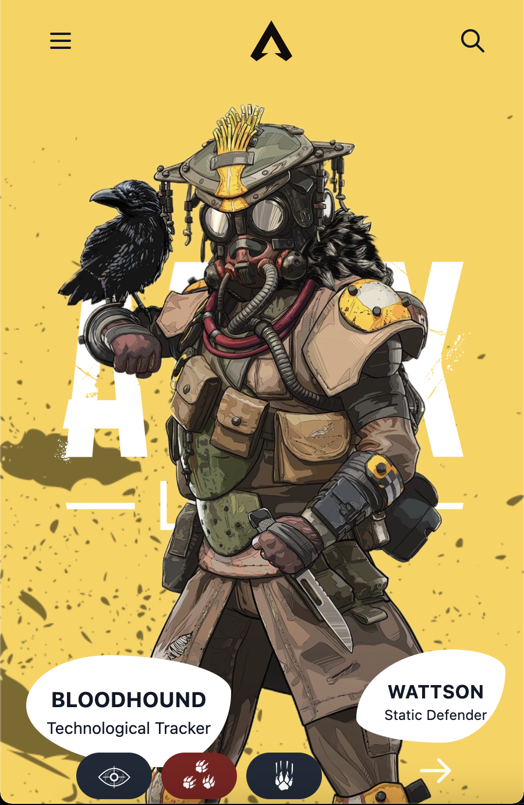

# Apex Legends Site

Got bored and suddenly decided to whip up this website one night. So yeah this is just me having fun doing whatever. It is made with ViteJS, ReactJS and TailwindCSS.

## Credits

Coded by [@jorenrui](https://jorenrui.netlify.app).

Design inspired from the [dribbble shot by Ashutosh Nirwan for Nickelfox](https://dribbble.com/shots/9526331-APEX)

## Techs Used:
- [ViteJS](https://vitejs.dev/)
- [ReactJS](https://reactjs.org/)
- [TypeScript](https://www.typescriptlang.org/)
- [TailwindCSS](https://tailwindcss.com/)
- [Headless UI's Disclosure](https://headlessui.dev/react/disclosure)
- [Apex Legends - Images & Info](https://www.ea.com/games/apex-legends)

## License

Free to use but are you sure you want this mess? 🙈

MIT © [Joeylene Rivera](https://github.com/jorenrui)
